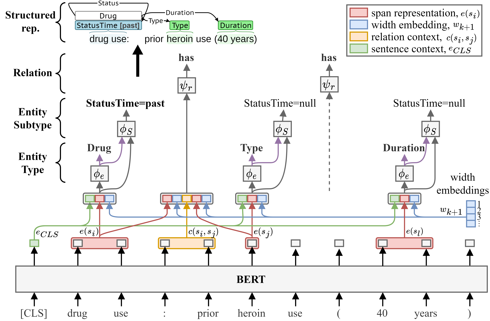

# Multi-label Span-based Entity and Relation Transformer (mSpERT)
This repository contains the Pipeline code for training and evaluating the mSpERT model. mSpERT is an augmented version of the original [Span-based Entity and Relation Transformer](https://ebooks.iospress.nl/volumearticle/55116) (SpERT) model developed by Eberts and Ulges [1]. SpERT jointly extracts entities and relations using BERT with output layers that classify spans and predict span relations. SpERT's span-based architecture allows overlapping span predictions but only allows a single label to be assigned to each span; however, annoataion schemes may assign multiple labels to a single span. We added additional classification layers to SpERT to accommodate multi-label span predictions. Figure 1 presents the mSpERT framework, which includes three classification layers: 1) Entity Type, 2) Entity Subtype, and 3) Relation.  The Entity Type and Relation layers are identical to the original SpERT, and the Entity Subtype layer is incorporated to generate multi-label span predictions. The example in Figure 1 is from out Social Determinant of Health (SDOH) event extraction work [2]. mSpERT was developed by cloning the [original SpERT GitHub repository](https://github.com/lavis-nlp/spert).




## Setup
### Requirements
- Required
  - Python 3.5+
  - PyTorch (tested with version 1.4.0)
  - transformers (+sentencepiece, e.g. with 'pip install transformers[sentencepiece]', tested with version 4.1.1)
  - scikit-learn (tested with version 0.24.0)
  - tqdm (tested with version 4.55.1)
  - numpy (tested with version 1.17.4)
- Optional
  - jinja2 (tested with version 2.10.3) - if installed, used to export relation extraction examples
  - tensorboardX (tested with version 1.6) - if installed, used to save training process to tensorboard
  - spacy (tested with version 3.0.1) - if installed, used to tokenize sentences for prediction

### Fetch data
Fetch converted (to specific JSON format) CoNLL04 \[1\] (we use the same split as \[4\]), SciERC \[2\] and ADE \[3\] datasets (see referenced papers for the original datasets):
```
bash ./scripts/fetch_datasets.sh
``` 

Fetch model checkpoints (best out of 5 runs for each dataset):
```
bash ./scripts/fetch_models.sh
```
The attached ADE model was trained on split "1" ("ade_split_1_train.json" / "ade_split_1_test.json") under "data/datasets/ade".

## Examples
(1) Train CoNLL04 on train dataset, evaluate on dev dataset:
```
python ./spert.py train --config configs/example_train.conf
```

(2) Evaluate the CoNLL04 model on test dataset:
```
python ./spert.py eval --config configs/example_eval.conf
```

(3) Use the CoNLL04 model for prediction. See the file 'data/datasets/conll04/conll04_prediction_example.json' for supported data formats. You have three options to specify the input sentences, choose the one that suits your needs. If the dataset contains raw sentences, 'spacy' must be installed for tokenization. Download a spacy model via 'python -m spacy download model_label' and set it as spacy_model in the configuration file (see 'configs/example_predict.conf'). 
```
python ./spert.py predict --config configs/example_predict.conf
```

## References
1. Eberts M, Ulges A. Span-Based Joint Entity and Relation Extraction with Transformer Pre-Training. In: European Conference on Artificial Intelligence; 2020. p. 2006-13. Available from: [https://ebooks.iospress.nl/volumearticle/55116](https://ebooks.iospress.nl/volumearticle/55116).
2. K. Lybarger*, N. J. Dobbins*, R. Long, A. Singh, P.Wedgeworth, O. Ozuner, and M. Yetisgen. Leveraging natural language processing to augment structured social determinants of health data in the electronic health record. under review, 2023. doi: [10.48550/arXiv.2212.07538](https://doi.org/10.48550/arXiv.2212.07538).

*Authors contributed equally.
